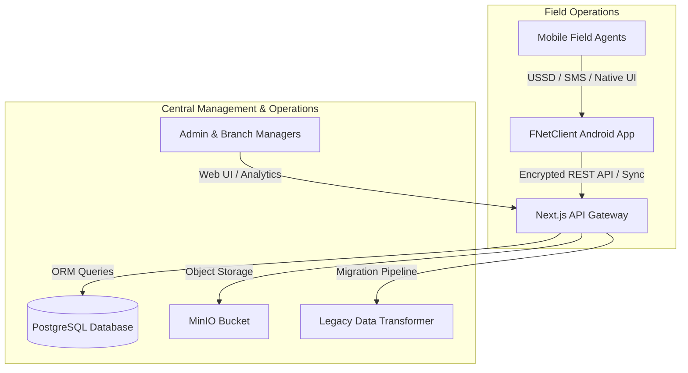

# FNet Ghana Platform & Mobile Client Ecosystem

<p align="center">
  <picture>
    <source media="(prefers-color-scheme: dark)" srcset="https://shieldcn.dev/header/glow.svg?title=FNet+Ghana+Ecosystem&subtitle=Financial+Operations%2C+Agent+Management+%26+Mobile+Money+Automation&logo=nextdotjs&mode=dark&theme=violet" />
    
  </picture>
</p>

<p align="center">
  <a href="https://github.com/samcuxx/FnetGhana"></a>
  <a href="https://github.com/samcuxx/FNetClient"></a>
  <a href="https://github.com/samcuxx/FnetGhana"></a>
  <a href="https://github.com/samcuxx/FnetGhana"></a>
  <a href="https://github.com/samcuxx/FnetGhana"></a>
</p>

---

## 📌 Executive Overview

**FNet Ghana** is an enterprise-grade financial operations and agent banking platform designed for managing Mobile Money (MTN MoMo, Telecel Cash, AT Money), bank liquidity, funding approvals, agent liabilities, and daily financial reconciliation across Ghana.

The ecosystem consists of two core applications working in tandem:

1. **[FnetGhana](./FnetGhana)**: Next.js 16 Web Administration Portal & Central API Platform. Provides managers and admins with high-performance transaction processing, automated bank-wallet matching, real-time analytics, and data migration pipelines.
2. **[FNetClient](./FNetClient)**: Native Android Client App built with Jetpack Compose & Kotlin. Equips field agents and branch operators with guided USSD execution, SMS payment parsing, offline transaction logging, and instant synchronization.

---

## 🏛️ System Architecture



---

## 📂 Project Component Directory

| Component | Description | Tech Stack | README Link |
| :--- | :--- | :--- | :--- |
| **[FnetGhana](./FnetGhana)** | Web Administration Dashboard, Manager Approvals, Bank Matching & APIs | Next.js 16, React 19, Prisma, PostgreSQL, Tailwind CSS | [FnetGhana README](./FnetGhana/README.md) |
| **[FNetClient](./FNetClient)** | Android Client App for Agents, USSD Automation & SMS Parsing | Kotlin, Jetpack Compose, Material 3, Room, WorkManager | [FNetClient README](./FNetClient/README.md) |

---

## 🚀 Key Highlights & Capabilities

- **High-Performance Funding Queue**: 60% submission speedup with indexed lookups, parallel database operations, and frontend query caching.
- **USSD & SMS Automation**: Android accessibility service integration to execute USSD commands automatically and confirm incoming MoMo SMS notifications.
- **Role-Aware Security**: Fine-grained access control for Admins, Managers, Agents, and Branch Operators.
- **Bank & Wallet Liquidity Engine**: Real-time management of bank accounts, MoMo floats, cash-in/out, and liability balance reconciliation.
- **Legacy Migration Pipeline**: End-to-end extraction, transformation, and validation tools to import snapshot data seamlessly into PostgreSQL.

---

## 🛠️ Quick Start

### 1. Web Management Platform (`FnetGhana`)

```bash
cd FnetGhana

# Install dependencies & generate Prisma client
npm install

# Start development server
npm run dev
```

### 2. Android Client App (`FNetClient`)

```bash
cd FNetClient

# Build debug APK
./gradlew assembleDebug

# Install on connected Android device
./gradlew installDebug
```

---

## 📄 License & Maintainer

Maintained with ❤️ by **[SamCux](https://github.com/samcuxx)**.  
For technical support or inquiries, contact `samcuxx@gmail.com`.
